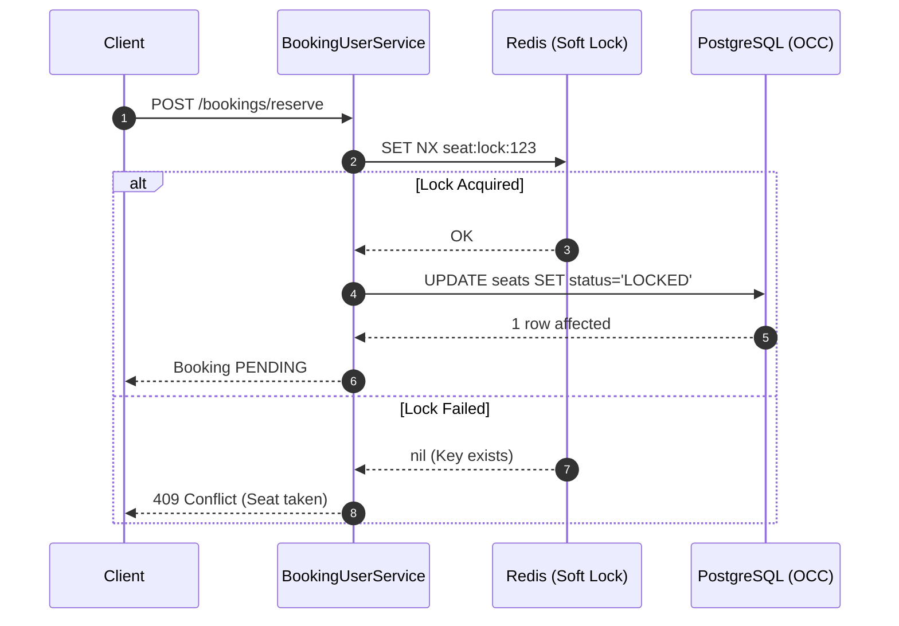
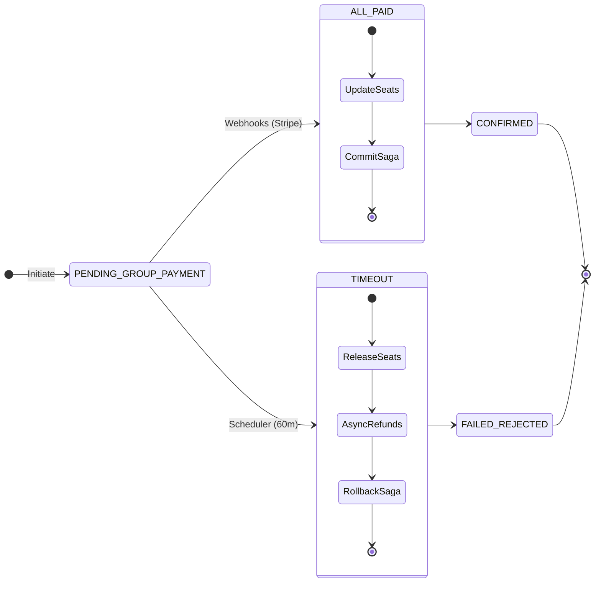
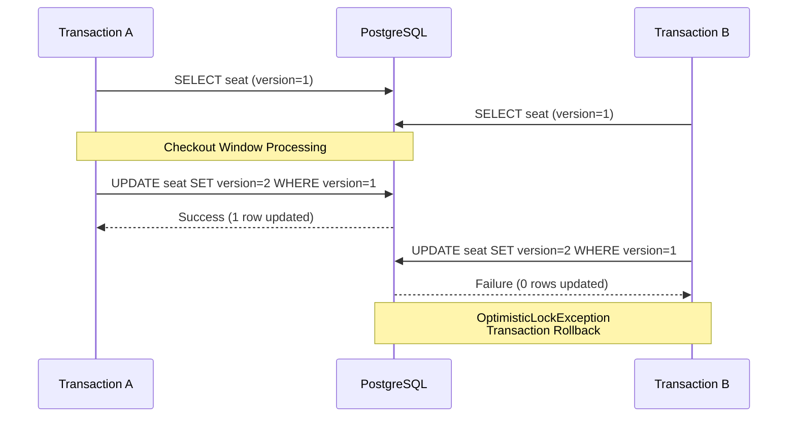
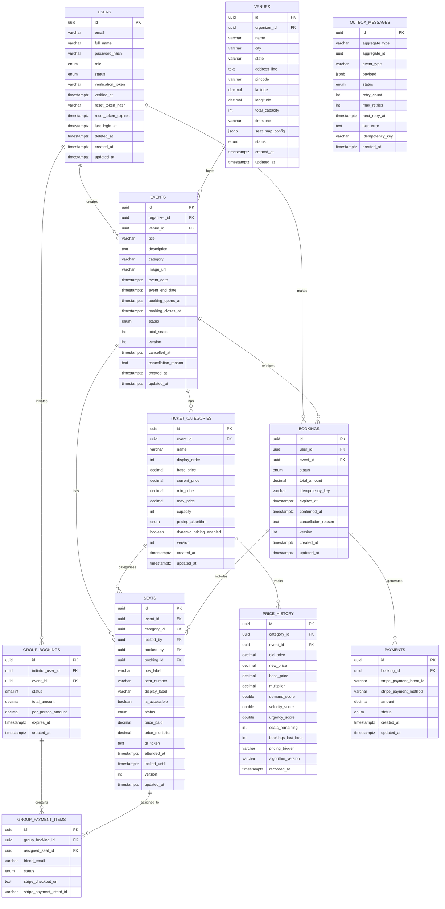
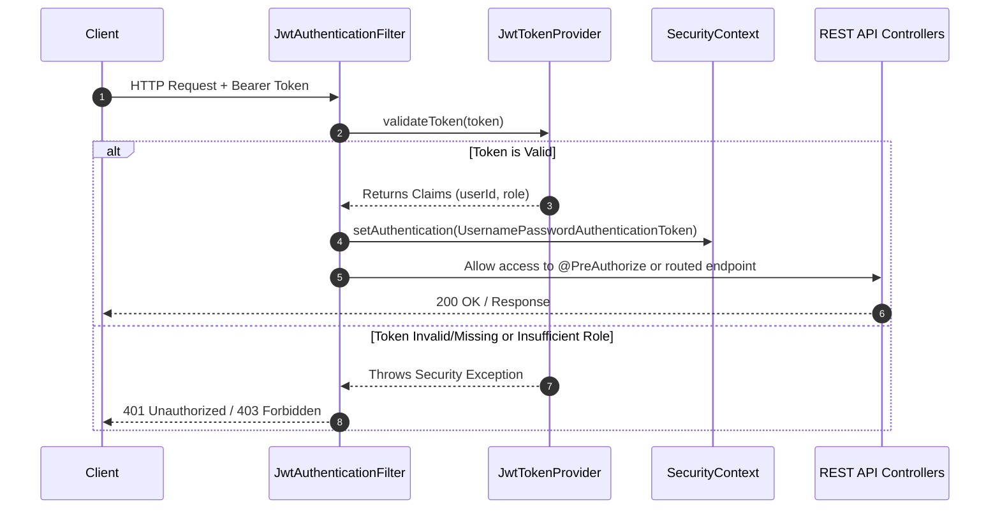

# RushTix — Backend API

### Production-Grade Event Ticketing API | Spring Boot 4 · Java 17 · PostgreSQL · Redis

RushTix Backend is a high-performance event ticketing system built to handle highly concurrent seat booking scenarios. It solves the critical double-booking anomaly using a robust Two-Phase Locking strategy, orchestrates split payments via Saga patterns, and ensures data integrity with Optimistic Concurrency Control (OCC) and Transactional Outboxes.

---

## Table of Contents

- [Architecture](#architecture)
- [Project Structure](#project-structure)
- [Technical Deep Dives](#technical-deep-dives)
  - [Preventing Double Bookings — Two-Phase Locking](#preventing-double-bookings--two-phase-locking)
  - [Group Booking Saga Orchestration](#group-booking-saga-orchestration)
  - [Optimistic Concurrency Control (OCC)](#optimistic-concurrency-control-occ)
  - [Automated Inventory Reclamation](#automated-inventory-reclamation)
  - [Transactional Outbox Pattern](#transactional-outbox-pattern)
- [Database Schema](#database-schema)
- [Local Development Setup](#local-development-setup)
- [Key Engineering Decisions](#key-engineering-decisions)

---

## Architecture

### High-Level Topology

```mermaid
graph TD
    subgraph Client [Client Tier]
        Desktop[Web Browser / Organizer Dashboard]
        Mobile[Mobile Device / Attendees]
    end

    subgraph APIGateway [Security Layer]
        CORS[CORS Filter]
        JWTFilter[JWT Authentication Filter]
        SpringSec[Spring Security Context]
    end

    subgraph Core [Spring Boot Core Backend]
        subgraph Controllers [REST Controllers]
            AuthCtrl[AuthController]
            OrgCtrl[OrganizerController]
            BookingCtrl[BookingController]
            GroupCtrl[GroupBookingController]
            PublicCtrl[PublicEventsController]
            WebhookCtrl[StripeWebhookController]
        end

        subgraph Business [Business Logic Services]
            AuthSvc[AuthenticationService]
            EventSvc[EventManagementService]
            SeatSvc[SeatManagementService]
            BookingSvc[BookingUserService]
            SagaSvc[GroupPaySagaOrchestrator]
            LockSvc[RedisLockService]
            PaymentSvc[PaymentGatewayService]
        end

        subgraph Background [Background Jobs]
            ExpiryJob[BookingCleanUpScheduler]
            TimeoutJob[GroupBookingTimeoutWorker]
            OutboxProc[Outbox Processor Worker]
        end

        subgraph DataAccess [Data Access Layer]
            Repositories[Spring Data JPA Repositories]
            OutboxRepo[OutboxMessageRepository]
        end
    end

    subgraph Infrastructure [Data Infrastructure]
        PG[(PostgreSQL 16<br/>Relational DB / OCC)]
        Redis[(Redis 7<br/>Distributed Locks)]
    end

    subgraph External [External Services]
        StripeAPI[Stripe Payments API]
    end

    %% Client Flow
    Desktop --> CORS
    Mobile --> CORS

    %% Gateway to Backend
    CORS --> JWTFilter
    JWTFilter --> SpringSec
    SpringSec --> Controllers

    %% Controllers to Services
    AuthCtrl --> AuthSvc
    OrgCtrl --> EventSvc
    OrgCtrl --> SeatSvc
    BookingCtrl --> BookingSvc
    GroupCtrl --> SagaSvc
    WebhookCtrl --> PaymentSvc

    %% Service interactions
    BookingSvc --> LockSvc
    BookingSvc --> PaymentSvc
    SagaSvc --> LockSvc
    SagaSvc --> PaymentSvc

    %% Services to Data
    EventSvc --> Repositories
    SeatSvc --> Repositories
    BookingSvc --> Repositories
    SagaSvc --> Repositories
    PaymentSvc --> Repositories
    AuthSvc --> Repositories

    %% Lock Service to Redis
    LockSvc -- SET NX / DEL --> Redis

    %% Repositories to DB
    Repositories -- JPA / Hibernate --> PG
    OutboxRepo -- JPA --> PG

    %% Background Jobs
    ExpiryJob -- Poll / Update --> Repositories
    TimeoutJob -- Check Status --> Repositories
    OutboxProc -- Poll / Publish --> OutboxRepo

    %% External System Integration
    PaymentSvc -- Create Intent / Refund --> StripeAPI
    StripeAPI -- Webhook Events --> WebhookCtrl

    classDef client fill:#f9f9f9,stroke:#333,stroke-width:2px,color:#000;
    classDef backend fill:#6db33f,stroke:#333,stroke-width:2px,color:#fff;
    classDef data fill:#336791,stroke:#333,stroke-width:2px,color:#fff;
    classDef redis fill:#d82c20,stroke:#333,stroke-width:2px,color:#fff;
    classDef external fill:#635bff,stroke:#333,stroke-width:2px,color:#fff;

    class Desktop,Mobile client;
    class CORS,JWTFilter,SpringSec,Controllers,Business,AuthCtrl,OrgCtrl,BookingCtrl,GroupCtrl,PublicCtrl,WebhookCtrl,AuthSvc,EventSvc,SeatSvc,BookingSvc,SagaSvc,LockSvc,PaymentSvc,Background,ExpiryJob,TimeoutJob,OutboxProc,DataAccess,Repositories,OutboxRepo backend;
    class PG data;
    class Redis redis;
    class StripeAPI external;
```



---

## Project Structure

```text
core/src/main/java/com/rushtix/core/
├── CoreApplication.java
├── config
│   ├── CorsConfig.java
│   └── SecurityConfig.java
├── domain
│   ├── entities
│   │   ├── Booking.java
│   │   ├── Event.java
│   │   ├── GroupBooking.java
│   │   ├── GroupPaymentItem.java
│   │   ├── OutboxMessage.java
│   │   ├── Payment.java
│   │   ├── PriceHistory.java
│   │   ├── Seat.java
│   │   ├── TicketCategory.java
│   │   ├── User.java
│   │   └── Venue.java
│   └── enums
│       ├── BookingStatus.java
│       ├── EventStatus.java
│       ├── GroupBookingStatus.java
│       ├── OutboxStatus.java
│       ├── PaymentStatus.java
│       ├── PricingAlgorithm.java
│       ├── Role.java
│       ├── SeatStatus.java
│       ├── SplitStatus.java
│       ├── UserStatus.java
│       └── VenueStatus.java
├── exception
│   └── GlobalExceptionHandler.java
├── feature
│   ├── auth
│   │   ├── api
│   │   │   └── AuthController.java
│   │   ├── dto
│   │   │   ├── AuthResponse.java
│   │   │   ├── LoginRequest.java
│   │   │   └── SignupRequest.java
│   │   ├── repository
│   │   │   └── UserRepository.java
│   │   └── service
│   │       └── AuthService.java
│   ├── booking
│   │   ├── api
│   │   │   ├── BookingController.java
│   │   │   ├── BookingOrganizerController.java
│   │   │   ├── StripeWebhookController.java
│   │   │   └── UserProfileTicketController.java
│   │   ├── dto
│   │   │   ├── BookingOrganizerDetailResponse.java
│   │   │   ├── BookingOrganizerProjection.java
│   │   │   ├── BookingOrganizerSummaryResponse.java
│   │   │   ├── BookingRequst.java
│   │   │   ├── BookingReservationResponse.java
│   │   │   ├── BookingStatusResponse.java
│   │   │   ├── BookingUserResponse.java
│   │   │   ├── TicketItemDetail.java
│   │   │   ├── TicketPassResponse.java
│   │   │   └── UserTicketSummaryResponse.java
│   │   ├── mapper
│   │   │   └── BookingMapper.java
│   │   ├── repository
│   │   │   ├── BookingRepository.java
│   │   │   └── PaymentRepository.java
│   │   ├── scheduler
│   │   │   └── BookingCleanUpScheduler.java
│   │   └── service
│   │       ├── BookingOrganizerService.java
│   │       ├── BookingUserService.java
│   │       ├── PaymentGatewayService.java
│   │       └── RedisLockService.java
│   ├── events
│   │   ├── api
│   │   │   ├── EventOrganizerController.java
│   │   │   └── EventPublicController.java
│   │   ├── dto
│   │   │   ├── EventDetailResponse.java
│   │   │   ├── EventInventoryTickerResponse.java
│   │   │   ├── EventRequest.java
│   │   │   ├── EventSummaryResponse.java
│   │   │   └── PublicEventDetailsResponse.java
│   │   ├── mapper
│   │   │   └── EventMapper.java
│   │   ├── repository
│   │   │   └── EventRepository.java
│   │   └── service
│   │       ├── EventPublicService.java
│   │       └── EventService.java
│   ├── grouppay
│   │   ├── api
│   │   │   └── GroupBookingController.java
│   │   ├── dto
│   │   │   ├── ClaimSplitLinkRequest.java
│   │   │   ├── ClaimSplitLinkResponse.java
│   │   │   ├── GroupBookingSagaStatusResponse.java
│   │   │   ├── InitiateGroupRequest.java
│   │   │   └── InitiateGroupResponse.java
│   │   ├── repository
│   │   │   ├── GroupBookingRepository.java
│   │   │   └── GroupPaymentItemRepository.java
│   │   └── service
│   │       ├── GroupBookingClaimService.java
│   │       ├── GroupBookingInitializationService.java
│   │       ├── GroupBookingTimeoutWorker.java
│   │       └── GroupPaySagaOrchestrator.java
│   ├── seat
│   │   ├── api
│   │   │   ├── SeatOrganizerController.java
│   │   │   └── SeatPublicController.java
│   │   ├── dto
│   │   │   ├── PublicSeatResponse.java
│   │   │   ├── SeatBulkCreateRequest.java
│   │   │   ├── SeatResponse.java
│   │   │   └── SeatUpdateRequest.java
│   │   ├── mapper
│   │   │   └── SeatMapper.java
│   │   ├── repository
│   │   │   └── SeatRepository.java
│   │   └── service
│   │       ├── PublicSeatService.java
│   │       └── SeatService.java
│   ├── ticketcategory
│   │   ├── api
│   │   │   ├── TicketCategoryAdminController.java
│   │   │   └── TicketCategoryPublicController.java
│   │   ├── dto
│   │   │   ├── PublicTicketCategoryResponse.java
│   │   │   ├── TicketCategoryRequest.java
│   │   │   └── TicketCategoryResponse.java
│   │   ├── mapper
│   │   │   └── TicketCategoryMapper.java
│   │   ├── repository
│   │   │   └── TicketCategoryRepository.java
│   │   └── service
│   │       ├── TicketCategoryService.java
│   │       └── TicketCategoryUserService.java
│   └── venue
│       ├── api
│       │   └── VenueOrganizerController.java
│       ├── dto
│       │   ├── OrganizerVenueResponse.java
│       │   ├── SeatMapUpdateRequest.java
│       │   └── VenueRequest.java
│       ├── mapper
│       │   └── VenueMapper.java
│       ├── repository
│       │   └── VenueRepository.java
│       └── service
│           └── VenueService.java
└── security
    ├── JwtAuthenticationFilter.java
    ├── JwtTokenProvider.java
    ├── RushTixUserDetailsService.java
    ├── SecurityUtils.java
    └── StripeConfig.java
```

---

## Technical Deep Dives

### Preventing Double Bookings — Two-Phase Locking

The most critical challenge in event ticketing is ensuring two users cannot book the same seat. RushTix utilizes a **Two-Phase Lock** strategy to guarantee correctness without sacrificing throughput.



**Phase 1 — Redis Soft Lock:**
Redis provides an atomic `SET NX` (Set if Not eXists) operation. This guarantees that only the first thread attempting to lock a specific seat ID will succeed. This operation happens before any database transaction begins, serving as a high-speed filter that rejects conflicting requests in under 10 milliseconds.

**Phase 2 — PostgreSQL Optimistic Concurrency Control:**
If Redis is completely unavailable, the system safely falls back to the database. The true source of truth remains the database's ACID properties, specifically enforced via Optimistic Locking during the state mutation.

### Group Booking Saga Orchestration

To handle group payments where multiple users split the cost, RushTix implements a choreography-free Saga pattern. The `GroupPaySagaOrchestrator` centralizes the coordination of multiple distributed Stripe checkout sessions.



When a timeout occurs, a compensating transaction (`rollbackSaga()`) is executed. Crucially, the external Stripe refunds are dispatched asynchronously via `CompletableFuture.runAsync()`. This decouples the database rollback from external network latency, ensuring the database transaction never blocks waiting for the Stripe API.

### Optimistic Concurrency Control (OCC)

RushTix avoids database-level row locking (`SELECT FOR UPDATE`) to maintain high throughput during traffic spikes. Instead, entities like `Seat`, `Event`, and `TicketCategory` carry a `@Version` column.



Under high concurrency, OCC allows complete parallelism. Conflict detection only occurs precisely at commit time. This design choice prevents database connection pool exhaustion that would otherwise occur if transactions were held open during long payment windows.

### Automated Inventory Reclamation

A scheduled Spring worker (`BookingCleanUpScheduler`) executes on a fixed rate interval of 60 seconds:

```java
@Scheduled(fixedRate = 60000)
@Transactional
public void cleanUpExpiredBookings() {
    List<Booking> expired = bookingRepository
        .findAllByStatusAndExpiresAtBefore(BookingStatus.PENDING, OffsetDateTime.now());

    for (Booking booking : expired) {
        booking.setStatus(BookingStatus.CANCELLED);
        for (Seat seat : booking.getSeats()) {
            seat.setStatus(SeatStatus.AVAILABLE);
            seat.setBooking(null);
            seat.setLockedBy(null);
            seat.setLockedUntil(null);
        }
    }
    bookingRepository.saveAll(expired);
}
```

This mitigates inventory leakage, ensuring that a 10-minute checkout lock does not become permanent due to client abandonment.

### Transactional Outbox Pattern

The `OutboxMessage` entity implements the **Transactional Outbox** pattern. Writing to the outbox table occurs inside the identical database transaction as the booking commit. This entirely eliminates the dual-write hazard where a booking successfully commits but the downstream notification event is lost due to an application crash.

Each outbox record consists of: `aggregate_type`, `aggregate_id`, `event_type`, a JSONB `payload`, exponential backoff indicators (`retry_count`, `max_retries`, `next_retry_at`), and an `idempotency_key` string to prevent double-processing anomalies upon retry.

---

## Database Schema



---

## Security

RushTix implements a robust security architecture using **Spring Security** combined with stateless JWTs (JSON Web Tokens).

* **Authentication Filter Chain**: All incoming requests pass through `JwtAuthenticationFilter`, which verifies the HS256 JWT signature using `JwtTokenProvider` before any controller logic executes.
* **Role-Based Access Control (RBAC)**: Routes are strictly protected based on `Role` (`ORGANIZER` vs `ATTENDEE`). Endpoints like `/api/v1/organizer/**` require the `ROLE_ORGANIZER` authority.
* **Stateless Sessions**: The backend maintains no session state. The user's identity and roles are embedded securely within the JWT payload.
* **Context Propagation**: The `SecurityUtils` helper extracts the currently authenticated `userId` directly from the `SecurityContext`, preventing insecure direct object references (IDOR).
* **CORS Policy**: Configured globally via `CorsConfig` to explicitly allow only the trusted frontend origin, preventing cross-site request forgery.

### Spring Security RBAC Flow



---

## API Reference

### Authentication — `/api/v1/auth` (Public)

| Method | Endpoint | Auth | Description |
|--------|----------|------|-------------|
| `POST` | `/api/v1/auth/signup` | Public | Register a new user |
| `POST` | `/api/v1/auth/login` | Public | Authenticate and receive JWT |

**POST /api/v1/auth/signup — Request:**
```json
{
  "email": "organizer@example.com",
  "fullName": "Jane Doe",
  "password": "securepassword",
  "role": "ORGANIZER"
}
```
**Response:**
```json
{
  "token": "eyJhbGciOiJIUzI1NiJ9...",
  "userId": "9dd4da86-d792-408e-8f0c-b3972d190451",
  "role": "ORGANIZER"
}
```

### Public Events — `/api/v1/public/events` (Public)

| Method | Endpoint | Auth | Description |
|--------|----------|------|-------------|
| `GET` | `/api/v1/public/events` | Public | Discover events (filters: `category`, `city`, `state`, `venueId`) |
| `GET` | `/api/v1/public/events/{id}` | Public | Full event details with ticket categories |
| `GET` | `/api/v1/public/events/{id}/inventory` | Public | Live seat availability ticker |

### Bookings — `/api/v1/bookings` (JWT Required)

| Method | Endpoint | Auth | Description |
|--------|----------|------|-------------|
| `POST` | `/api/v1/bookings/reserve` | Bearer JWT | Lock seats and create PENDING reservation |
| `POST` | `/api/v1/bookings/{bookingId}/pay-single` | Bearer JWT | Initiate Stripe PaymentIntent |
| `GET` | `/api/v1/bookings/{bookingId}` | Bearer JWT | Get booking details with Stripe client secret |
| `GET` | `/api/v1/bookings/my-tickets` | Bearer JWT | List all confirmed tickets for current user |

**POST /api/v1/bookings/reserve — Request:**
```json
{
  "eventId": "706951c0-f8f1-4eca-a428-ec880af9a9ce",
  "seatIds": ["seat-uuid-1", "seat-uuid-2"],
  "idempotencyKey": "user-session-1234"
}
```
**Response:**
```json
{
  "bookingId": "b442ea43-1631-4789-b420-955fc26556e4",
  "status": "PENDING",
  "totalAmount": 2800.00,
  "expiresAt": "2026-07-05T10:25:00Z",
  "seats": [...]
}
```

### Group Bookings — `/api/v1/group-bookings` (JWT Required)

| Method | Endpoint | Auth | Description |
|--------|----------|------|-------------|
| `POST` | `/api/v1/group-bookings/initiate` | Bearer JWT | Start a split-pay Saga |
| `POST` | `/api/v1/group-bookings/claim` | Bearer JWT | Member claims their payment link |
| `GET` | `/api/v1/group-bookings/{id}/status` | Bearer JWT | Saga status and payment item states |

### Organizer Events — `/api/v1/organizer/events` (ROLE_ORGANIZER)

| Method | Endpoint | Auth | Description |
|--------|----------|------|-------------|
| `POST` | `/api/v1/organizer/events` | ORGANIZER | Create event |
| `GET` | `/api/v1/organizer/events` | ORGANIZER | List my events |
| `GET` | `/api/v1/organizer/events/{id}` | ORGANIZER | Get event details |
| `PUT` | `/api/v1/organizer/events/{id}` | ORGANIZER | Update event |
| `PATCH` | `/api/v1/organizer/events/{id}/publish` | ORGANIZER | DRAFT → PUBLISHED |
| `PATCH` | `/api/v1/organizer/events/{id}/cancel` | ORGANIZER | Cancel with optional reason |
| `DELETE` | `/api/v1/organizer/events/{id}` | ORGANIZER | Delete draft event |

### Organizer Bookings — `/api/v1/organizer` (ROLE_ORGANIZER)

| Method | Endpoint | Auth | Description |
|--------|----------|------|-------------|
| `GET` | `/api/v1/organizer/events/{eventId}/bookings` | ORGANIZER | Paginated bookings (params: `page`, `size`, `status`, `search`) |
| `GET` | `/api/v1/organizer/bookings/{bookingId}` | ORGANIZER | Full booking audit detail |

### Organizer Venues — `/api/v1/organizer/venues` (ROLE_ORGANIZER)

| Method | Endpoint | Auth | Description |
|--------|----------|------|-------------|
| `POST` | `/api/v1/organizer/venues` | ORGANIZER | Create venue |
| `GET` | `/api/v1/organizer/venues` | ORGANIZER | List my venues |
| `GET` | `/api/v1/organizer/venues/{id}` | ORGANIZER | Get venue |
| `PUT` | `/api/v1/organizer/venues/{id}` | ORGANIZER | Update venue |
| `PATCH` | `/api/v1/organizer/venues/{id}/seat-map` | ORGANIZER | Update seat map JSON |

### Ticket Categories

| Method | Endpoint | Auth | Description |
|--------|----------|------|-------------|
| `POST` | `/api/v1/organizer/ticket-categories` | ORGANIZER | Create category |
| `GET` | `/api/v1/organizer/ticket-categories/{eventId}` | ORGANIZER | List categories |
| `PUT` | `/api/v1/organizer/ticket-categories/{id}` | ORGANIZER | Update pricing/capacity |
| `DELETE` | `/api/v1/organizer/ticket-categories/{id}` | ORGANIZER | Delete category |
| `GET` | `/api/v1/public/ticket-categories/{eventId}` | Public | Public categories with live prices |

### Seats

| Method | Endpoint | Auth | Description |
|--------|----------|------|-------------|
| `POST` | `/api/v1/organizer/seats/bulk` | ORGANIZER | Bulk-create seats |
| `GET` | `/api/v1/organizer/seats/{eventId}` | ORGANIZER | List seats with status |
| `PUT` | `/api/v1/organizer/seats/{id}` | ORGANIZER | Update seat metadata |
| `GET` | `/api/v1/public/seats/{eventId}` | Public | Available seats for booking |

### Stripe Webhook

| Method | Endpoint | Auth | Description |
|--------|----------|------|-------------|
| `POST` | `/api/v1/stripe/webhook` | Stripe signature | `payment_intent.succeeded` handler |

### User Tickets

| Method | Endpoint | Auth | Description |
|--------|----------|------|-------------|
| `GET` | `/api/v1/user/tickets` | Bearer JWT | All confirmed tickets with QR tokens |

---

## Local Development Setup

### Prerequisites

| Tool | Minimum Version |
|------|----------------|
| Java | 17 |
| Maven | 3.9+ |
| Docker | 24+ |
| Stripe CLI | latest |

### Backend Setup

**1. Start PostgreSQL and Redis:**
```bash
docker run -d --name rushtix-postgres \
  -e POSTGRES_USER=rushtix_admin \
  -e POSTGRES_PASSWORD=secretpassword \
  -e POSTGRES_DB=rushtix_db \
  -p 5433:5432 postgres:16

docker run -d --name rushtix-redis \
  -p 6380:6379 redis:7
```

**2. Configure `core/src/main/resources/application.properties`:**
```properties
spring.datasource.url=jdbc:postgresql://localhost:5433/rushtix_db
spring.datasource.username=rushtix_admin
spring.datasource.password=secretpassword
spring.data.redis.host=localhost
spring.data.redis.port=6380
app.security.jwt-secret=your-32-char-min-secret-key-here
stripe.api.secret-key=sk_test_...
stripe.webhook.secret=whsec_...
```

**3. Run Spring Boot:**
```bash
./mvnw spring-boot:run
# API available at http://localhost:8080
# Flyway auto-runs all schema migrations on startup
```

**4. Forward Stripe webhooks:**
```bash
stripe listen --forward-to localhost:8080/api/v1/stripe/webhook
```

### Environment Variables Reference

| Variable | Required | Description |
|----------|----------|-------------|
| `spring.datasource.url` | Yes | PostgreSQL JDBC URL |
| `spring.datasource.username` | Yes | PostgreSQL username |
| `spring.datasource.password` | Yes | PostgreSQL password |
| `spring.data.redis.host` | Yes | Redis hostname (Upstash host for prod) |
| `spring.data.redis.port` | Yes | Redis port |
| `app.security.jwt-secret` | Yes | HS256 signing secret — min 32 characters |
| `app.security.jwt-expiration-ms` | Yes | JWT expiry in ms (e.g., `864000000` = 10 days) |
| `stripe.api.secret-key` | Yes | Stripe secret key (`sk_test_...` or `sk_live_...`) |
| `stripe.webhook.secret` | Yes | Stripe webhook signing secret (`whsec_...`) |

---

## Key Engineering Decisions

**1. UUID Primary Keys over Auto-Increment**
Auto-increment IDs are sequential and guessable. An attacker can enumerate `/bookings/1`, `/bookings/2` etc. UUIDs are 122-bit random values. `GenerationType.UUID` generates IDs at the application layer, removing a DB round-trip. Future multi-region sharding has no ID collision risk.

**2. Optimistic Locking over Pessimistic (`SELECT FOR UPDATE`)**
`SELECT FOR UPDATE` holds a row lock for the entire Stripe payment window (2-10 seconds). Under concurrent load this serializes all checkouts for popular seats. OCC allows full parallelism — conflicts are only detected at commit time, and the conflict rate is low when users choose different seats.

**3. Redis as Soft Lock, Not Source of Truth**
Redis is fast but not ACID. The seat lock in Redis gives users immediate feedback without a DB write. If Redis is down, the system falls back to PostgreSQL OCC — Redis is intentionally **outside the correctness critical path**. Designs that make Redis a source of truth create split-brain risk.

**4. Saga Pattern for Group Payments over Two-Phase Commit**
Two-phase commit across Stripe's API (an external system) is not feasible. The Saga uses compensating transactions: if any member's payment fails, `rollbackSaga()` reverses all DB changes and asynchronously refunds paid members via Stripe. Stripe refunds are async to prevent API timeouts from blocking the DB rollback.

**5. Append-Only `price_history` over In-Place Updates**
Updating the price in-place destroys the audit trail. Every price change is a new row with ML feature values captured at decision time. This table doubles as the ML training dataset. The schema is already provisioned for `algorithm_version` tracking across model iterations.

**6. `@Formula` for Derived Fields over Denormalized Counters**
Maintaining `seats_sold_count` as a denormalized counter requires UPDATE to the event row on every seat status change, adding write contention and drift risk. `@Formula` subqueries compute values on read. For the organizer dashboard (low frequency, no sub-millisecond SLA) this is the right trade-off.

**7. `@Scheduled` Cleanup over Redis Keyspace Expiry Notifications**
Redis Keyspace Notifications must be explicitly enabled in Redis config and can be lost on connection failure. A simple Spring `@Scheduled` polling job is operationally simpler, predictable, and easy to monitor. The 60-second sweep window is a deliberate product decision — shorter would add load for no user-visible benefit.

**8. Transactional Outbox for Reliable Side Effects**
Writing `notificationService.send()` after `bookingRepository.save()` is a common bug: if the JVM crashes between them, the booking commits but the notification is lost. The Outbox writes the notification record inside the same transaction as the booking. A background worker delivers it. The DB's durability guarantee replaces the JVM staying alive.
